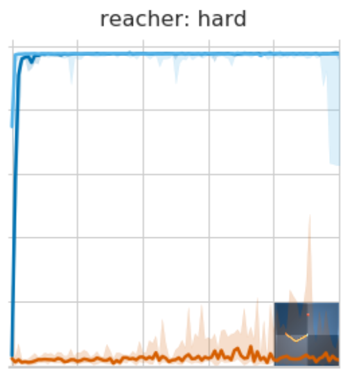
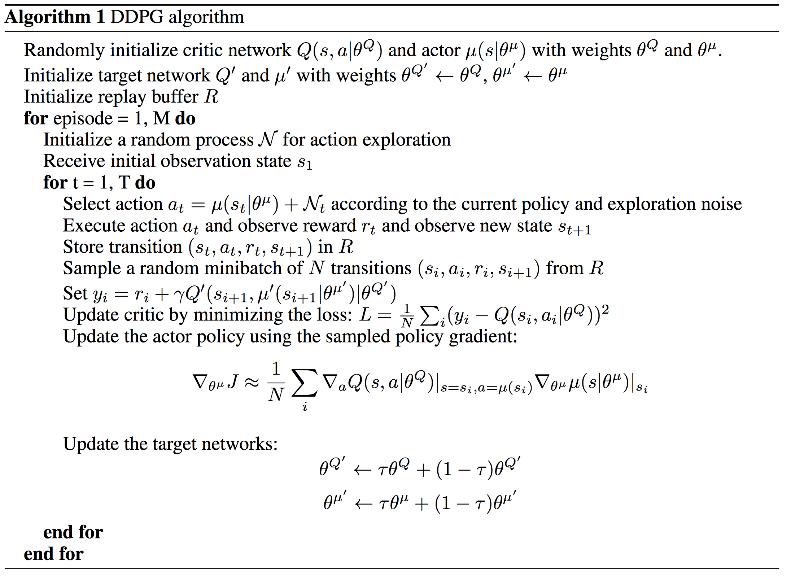

# Intro

This project looks at implementing the Deep Deterministic Policy Gradient (DDPG) algorithm in order to solve the Reacher environment.

This implementation used the ddpg pendulum example from the Udacity deep reinforcment learning repository as a foundation and was adapted to suite the Reacher environment. This project can be found [here](https://github.com/udacity/deep-reinforcement-learning/tree/master/ddpg-pendulum)

The Reacher environment provided an interesting challenge and required several subtle but integral changes to the my initial code in order for the agent to train successfully.

# The Environment

The environment used for this project was built using the Unity [ml-agents](https://github.com/Unity-Technologies/ml-agents) framework.

In this environment, a double-jointed arm can move to target locations. A reward of +0.1 is provided for each step that the agent's hand is in the goal location. Thus, the goal of your agent is to maintain its position at the target location for as many time steps as possible.

The observation space consists of 33 variables corresponding to position, rotation, velocity, and angular velocities of the arm. 

Each action is a vector with four numbers, corresponding to torque applicable to two joints. Every entry in the action vector should be a number between -1 and 1.

# Algorithm Used - DDPG

I chose to go with DDPG as the DeepMind paper [DeepMind Control Suite](https://arxiv.org/pdf/1801.00690.pdf) shows that it has excellent results in a similar reacher environment. Here the paper looks at A3C, DDPG and D4PG. The results shows that D4PG drastically outperforms A3C and was followed closely by DDPG.

The graph below shows the results of the papers experiments on the Reacher:Hard environment from deepmind. A3C(Orange) DDPG(Light Blue), D4PG(Dark Blue):
 

I chose to implement DDPG over D4PG as DDPG is more data efficient before 1e7 environment steps[paper]. My resources and amount of time I can afford to spend training my model is significantly less than that of DeepMind, as such I prioritized DDPG as it will train more efficiently when given less training steps.

This report will go through the methodology of DDPG, the experiments and changes I made during training, the results achieved from these experiments and finally my thoughts on future work.

## Methodology

DDPG is an off-policy, actor critic method that performs more like an advanced DQN built for continuous tasks. Although DQN has achieved superhuman performance on a number of environments such as the Atari games, it can only handle discrete and low-dimensional action spaces[ddpg paper]. As such it cant handle continuous action spaces. This problem can be solved by combining the techniques used in DQN with the actor-critic methodology.

As stated previously it is impractical to try and map Q values to state/actions for continuous tasks as Q learning requires an optimization step at each time step. This step is simply too slow for large, unconstrained function approximators and nontrivial action spaces[ddpg paper]. Instead DDPG uses the actor network to maintain the current deterministic policy using the actor function μ(s|θμ) which maps states to the best action. Just like in Q learning, the critic is learned using the Q function Q(s|a) to determine the state/action value. During this calculation the critic takes in the output of the actor as target for training, similar to the approach used in DQN.

As stated previously, DDPG builds upon much of the methodology used in DQN. As this is an off-policy method, DDPG uses experience replay to store large amounts of timesteps (s,a,r,s') and samples minibatches of these experiences in order to leanr/update the agents networks.

One problem seen in many experiments using Q learning with neural networks is that the traing can be unstable. This is due to the fact that the network being updated Q(s,a|θQ) is also used in calculating the target value [ddpg_paper]. DQN (Mnih et al., 2013) solved this using a target network, this was further improved on by using Double DQN's(https://arxiv.org/abs/1509.06461). DDPG has a different approach to this problem using "soft" target updates instead of directly copying weights [ddpg_paper]. As in DQN, two networks are maintained for both the actor and critic, the local and target network. Instead of directly copying weights at regular intervals, soft updates mixes in 0.01% of the local network into the target network. This makes the network change slowly and greatly improves training stability.

The final problem associated with continuous action spaced environments is that of exploration. DQN uses an epsilon-greedy approach, that works well for discrete action spaces but is not sufficient for continuous action spaces. Instead DDPG  constructs an exploration policy μ′ by adding noise sampled from a noise process N to our actor policy[ddpg paper]. The noise used here is the Ornstein-Uhlenbeck process (Uhlenbeck & Ornstein, 1930).

      μ′(st) = μ(st|θtμ) + N

## Experiments and Training

One of the main appeals of the DDPG algorithms is the simplicity of its implementation while still providing state of the art results. Although the implementation is simple, fine tuning the architecture and parameters of the agent can still be a difficult and time consuming task. During my implementation of the algorithm I ran into several problems that were eventaully solved by making changes to several key areas.

**Updates**

As seen in the pseudo code adove, the original paper shows that the algorithm performs an update step at each time step. When trying this in my initial experiments the agent was unable to get passed an average score of 1. During my research that other people tried to periodically update the agent, for example every 10 timesteps the agent would 20 update steps. This was in an attempt to update with a larger and more diverse sample. I experimented with several variations of update frequency and iterations. Eventually I tried only updating the agent at the end of an episode for 10 timesteps and this proved to provide the most stable results. I am still unsure why this performed better than simply updating at each timestep as seen in the paper. My theory is that by waiting for the end of the episode there is a more diverse experience buffer to sample from which  improves the stability of the agent. 

**Catastrophic Forgetting**

A common problem when training neural networks is that convergence and stabilty is not garunteed. This is painfully displayed in the phenomenon known as "catastrophic forgetting". This is when a network continues to improve until it will begin to (sometimes suddenly) deteriorate. This is shown in the graph below.

It is still unclear what exactly causes this convergence on a poor policy but is likely a combination of poor hyper-parameters. During my research and experiments I discovered that the samples used during the update step was critical for fixing this issue. By increase the size of my experience replay buffer to 10000000 and my batch size to 512 the agents training stablized. I believe this comes back to the problem seen in my update steps of diverse samples. By increasing the amount of experiences store and the sample size, the agent is able to update and learn on more generalised data. This reduces the possibility of the agent getting stuck in a local minima due to poor experience replay.

** Model Architecture **

The final piece of the puzzle was finding the correct network architecture for the reacher agent. I experimented with both the initial architecture found in the Udacity example which was an MLP with 2 layers of 400 and 300 nodes each with a ReLU layer. Both the Actor and Critic used the same network architecture This model showed promise and was able to learn, but was incredibly slow, taking more than 50 episodes to get past an average score of 1. The next experiment was to use the same architecture found in DeepMinds paper[link] which was the same for the critic but used 300 and 200 nodes respectively for the actore layers. Again, this showed that the agent was learning, but was very slow. This could be that the initial training of the agent was slow but after an initial period would pick up. 

I began to suspect that the agent was unable to accurately assign credit correctly due to the (relative) complexity of the environment. In order to solve this I began experimenting with much larger networks. Eventually I settled on the follow network architecture and provided the best results for this environment.

| Layers           |Parameters           |
|:-------------:| :-------------:| 
| Dense Layer| 1000| 
| ReLU activation| NA|   
| Dense Layer| 1000| 
| ReLU activation| NA| 
|Dense Layer|4| 

## Memory

One of the main improvements provided by the DQN paper is the use of Experience Replay. This acts like episodic memory and allows our agent to continually learn from its previous experiences as opposed to throughing them away at the end of each step. The use of experience replay has a few steps:

1) We need to observe our environment for several iterations in order to fill up our memory buffer with enough experiences to learn from. At each time step we will add our experience to our memory buffer. This experience stores the state, action, reward, next state and done variables for that step.

2) When we have enough memories stored (at least equal to our batch size) we can start learning. At each time step, after we add our experience to our buffer we check and see if we want to perform a learning step (every 4 steps) if so we sample from our memory buffer

3)Once we have this sample of previous experiences we can train on them. This will allow our agent to learn how to correctly approxminate the Q values. The details of this method will be discussed in the next section

## Agent

Next we have our agent. This of course the main portion of the project and ties everything together. The details of the agent are in the notebook itself but I will give a breif overview of the key parts

The agent can be intialised with several augmentations. The base model is set by default. This used only the standard DQN moel. Double Learning, Duelling Networks and Prioritized Experience Replay can all be added and removed during initialization.

The step function in the agent is taken after the environment step function and shouldn't be confused. Here we take in the state, action, reward, next_state and done variables from the last step and add it to our experience replay buffer. Then the agent carries out the learn function.

Inside the learn function we take a sample from our experience replay buffer and iterate through that sample of experience. For each of these we update the Q value corresponding to the state action pair. This is done by computing the loss between the target and the expected prediction. In the base model the target is the predicted Q value of the next states and choosing the best best action using our target model. We then calculate the discounted rewards of that target model prediction to form our new target. This is then compared to the local models prediction of the Q value given the initial state. After this we carry out a soft update of the target model.

The last function worth discussing is the act method. Here we take in the current state of the environment and get the best prediction from our local model. Next we use the epsilon greedy strategy to determine wether we use our models action or if we use a random action. 

# Training

The training portion of the notebook contains the main game loop iterating through the environment and utilising our agent. As with most machine learning problems, a lot of the improvements come from hyper parameter tuning. This can often taken longer than building the actual algorithm itself. Unfortunately I couldn't dedicate too much time to hyper parameter tuning and was only able to test a few changes for each type of model. Below are the parameters that I experimented with. Each parameter change was added in and tested individually in order to identify which parameter changes gave the best results.

| Parameter | Params 1 |  Params 2  |
|:-------------:| :-------------:| :-------------:| 
|Layer 1    | 16     |   32     |
|Layer 2    | 32     |   64     |
|Learning Rate    | 0.0005     |   0.0001     |
|Batch Size    | 64     |   32     |
|Buffer Size    | 100000     |  200000     |

The experiments showed that the hyperparameters didnt make a huge improvement, with most models reaching a stable score of 13 within 800 episodes and a score ~15-17 after 2000. The variation on the agents final score was mostly influenced by the type of model used. The hyperparameters mainly effected how quickly the agent could reach a score of 13+. For example, the base DQN with the initial set of parameters learned to get a score of 13+ within ~450 episodes where as the same model with the second set of parameters took ~700 episodes. Both of these models achieved a final average score of 16 after 2000 episodes and could achieve the max score of 25. I believe that the model is capable achieving a better highscore with correct hyperparameter tuning and more training episodes. Below is the training graph of the base DQN agent running with the 2nd set of hyperparameters.

# Results

|Model| Episodes to reach 13+|
|:-------------:| :-------------:|
|DQN|430|
|Double DQN| 458|
|Duelling DQN| 473|
|Double Duelling DQN| 509|
|PER DQN| 898 |

I conclusion, all implementations of the DQN algorithm were capable of beating the environment (score of 13+) in under 550 episodes). My experiments have shown that the addition of the duelling network and double learning provided the best results for the navigation environment given 2000 training episodes. The agent was able to attain a high score of 17.43 on average over 100 episodes and frequently hit the high score of 25. I believe this is due to the duelling networks ability to generalise better than the standard DQN. On top of this, the addition of double learning made the agent more robust and stable, as you can see from the graph below. 

However it is worth pointing out that these results were only a little better than the standard agent, which could reach a score of ~16. 

# Future Work

## Furthur Hyperparameter Tuning
Like most machine learning problems I believe that this agent could be improved to reach a much higher average through hyperparameter tuning. With my limited amount of time to spend of the project I was only able to test 2 variations for each parameter. With more tuning I believe the agent could perform significantly better. Potentially I would like to use something like AuotMl or genetic algorithms to learn the best hyperparameters for this environment.

## Testing More Complicated Environments
As well as this I think that the reason that I did not see a big improvement from the additions is down to the fact that the environment itself is quite simple. Due the this, it is possible that the benefits of these improvements are not being seen. I would like to try these methods on a more complicated environment in the future such as the atari games.

